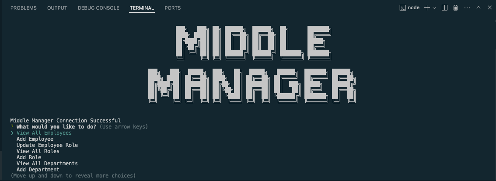
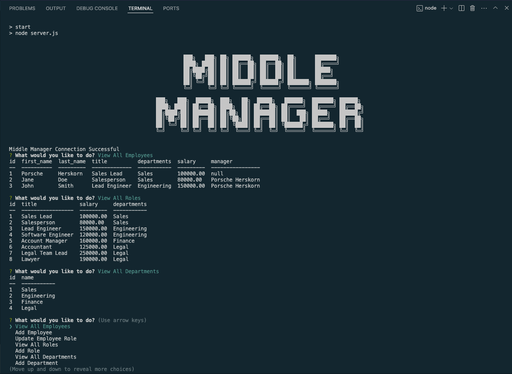

# Middle Manager

## Table of Contents

* [Description](#description)
* [Installation](#installation)
* [Usage](#usage)
* [Credits](#credits)
* [Technologies Used](#technologies-used)
* [License](#license)

## Description
The Middle Manager is a content managment system which provides users with an easy-to-use program to create and maintain a database of employee information. User input taken from a series of prompts is applied to tables within the database. The program utilizes Inquirer to register user input and MySQL2 to create and modify the database with the user responses.

Future development for this app would include functions to delete table data and implement a feature to view salary budgeting data.

## Installation
* [Inquirer v8.2.4](https://www.npmjs.com/package/inquirer/v/8.2.4) must be installed to operate this app.
* [MySQL2](https://www.npmjs.com/package/mysql2) must be installed to operate this app.
* [console.table](https://www.npmjs.com/package/console.table) must be installed to operate this app.
* [C Fonts](https://www.npmjs.com/package/cfonts) must be installed to operate design functionality of this app.

## Usage
[Clone the repository](https://github.com/eepitsporsche/middle_manager) to your machine and open the application in VS Code.

To initiate the Middle Manager, enter the <code>node server.js</code> command into the server.js terminal.

> [!IMPORTANT]
 Ensure you have installed all dependencies listed under [Installation](#installation) before initiating the program.

Users may navigate the menu using the up and down arrow keys and pressing enter on the desired selection.
Options include viewing and adding employees, viewing and adding employee roles, and viewing and adding departments.

> [Click here](https://drive.google.com/file/d/1sHYOx58db81USKxX5GhuHXRw-ijlCflE/view?usp=sharing) to view the video walk-through.

## Credits
* [SQL Shack](https://www.sqlshack.com/understanding-sql-decimal-data-type/) for information on data type syntax.
* [phoenix NAP](https://phoenixnap.com/kb/how-to-create-a-table-in-mysql) for information on MySQL table construction/modification.
* [Sam Meech-Ward Youtube Channel](https://www.youtube.com/watch?v=Hej48pi_lOc)
* [unblockMe YouTube Channel](https://www.youtube.com/watch?v=YW1CXRqF9AA)
* UCB Bootcamp Instructor: [Robbert Wijtman](https://github.com/Bucky24)
* UCB Bootcamp provided guidance for database table structure for this project.

## Technologies Used
* VS Code
* JavaScript
* Node.js
* Inquirer
* MySQL2

## License
<a href="https://opensource.org/licenses/MIT">MIT License</a>

Copyright© 2024 Porsche Herskorn

Permission is hereby granted, free of charge, to any person obtaining a copy of this software and associated documentation files (the "Software"), to deal in the Software without restriction, including without limitation the rights to use, copy, modify, merge, publish, distribute, sublicense, and/or sell copies of the Software, and to permit persons to whom the Software is furnished to do so, subject to the following conditions:

The above copyright notice and this permission notice shall be included in all copies or substantial portions of the Software.

THE SOFTWARE IS PROVIDED "AS IS", WITHOUT WARRANTY OF ANY KIND, EXPRESS OR IMPLIED, INCLUDING BUT NOT LIMITED TO THE WARRANTIES OF MERCHANTABILITY, FITNESS FOR A PARTICULAR PURPOSE AND NONINFRINGEMENT. IN NO EVENT SHALL THE AUTHORS OR COPYRIGHT HOLDERS BE LIABLE FOR ANY CLAIM, DAMAGES OR OTHER LIABILITY, WHETHER IN AN ACTION OF CONTRACT, TORT OR OTHERWISE, ARISING FROM, OUT OF OR IN CONNECTION WITH THE SOFTWARE OR THE USE OR OTHER DEALINGS IN THE SOFTWARE.

### 
[Back to Top](#middle-manager)
